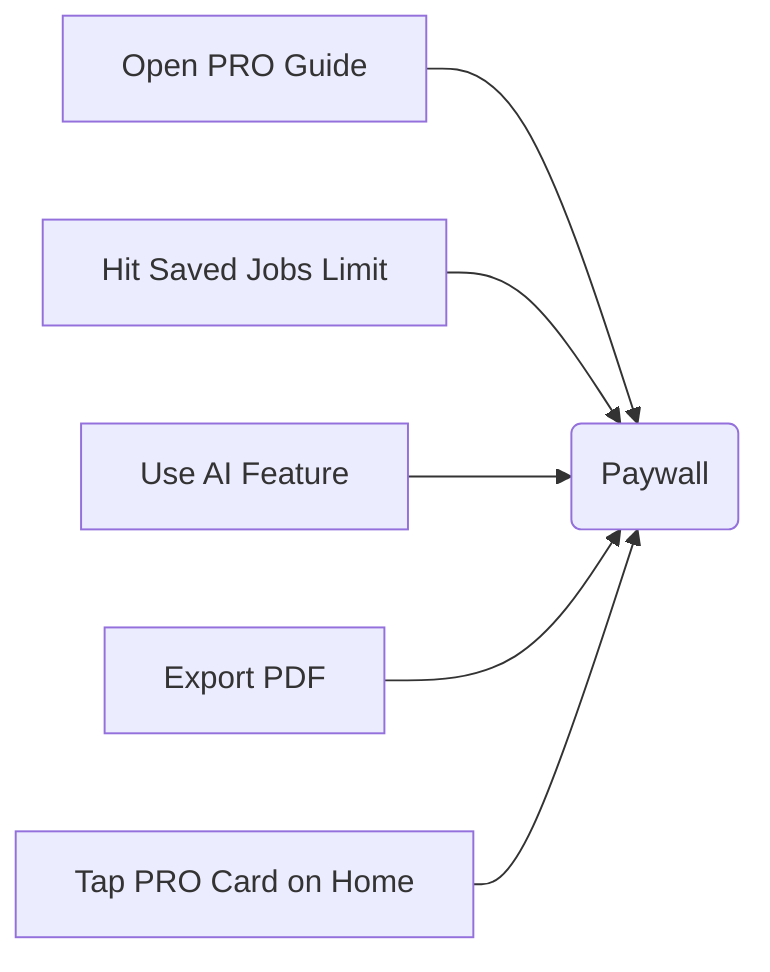
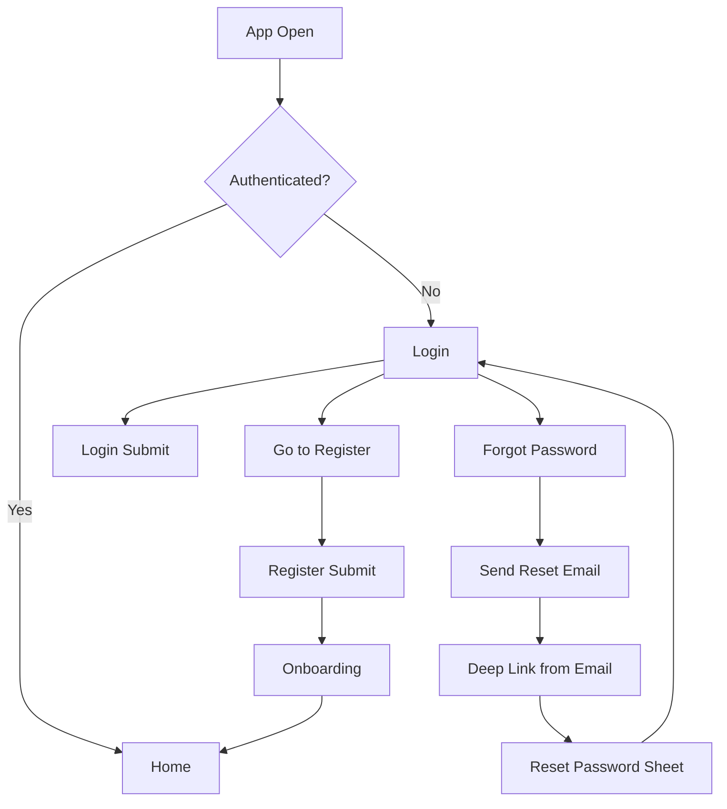
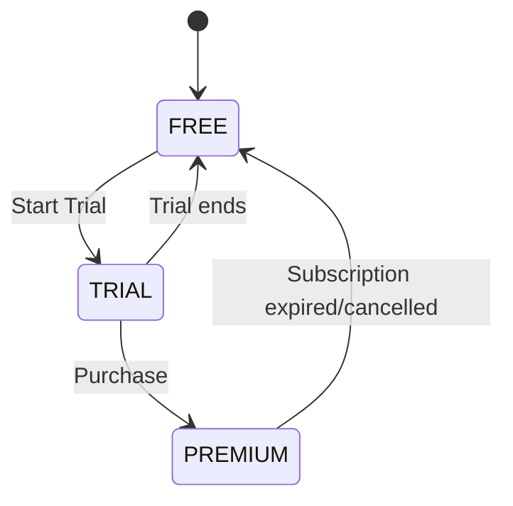
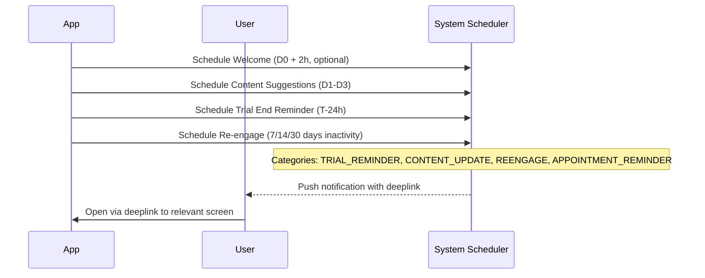
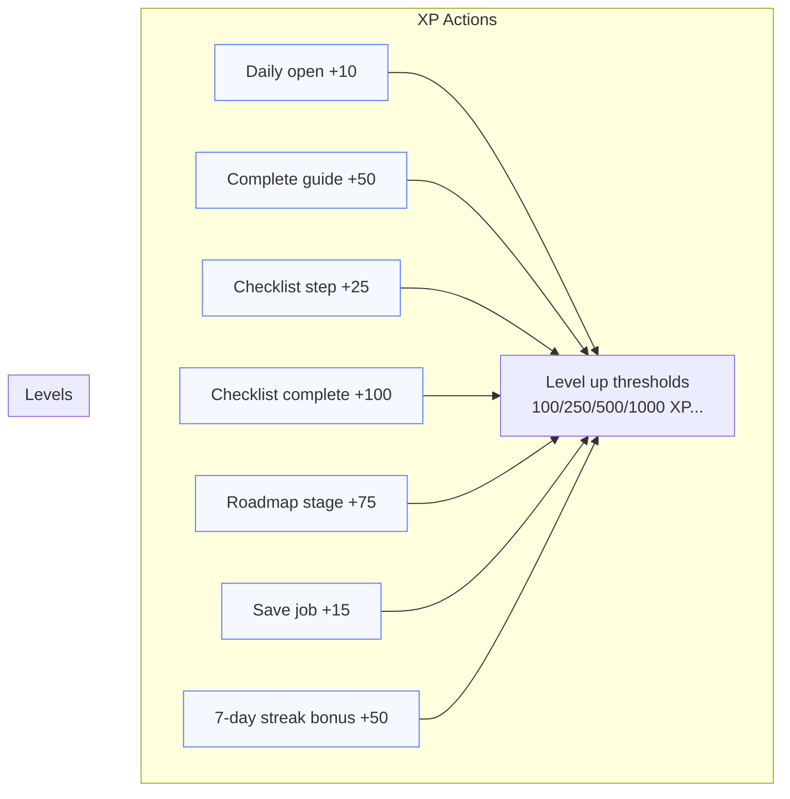
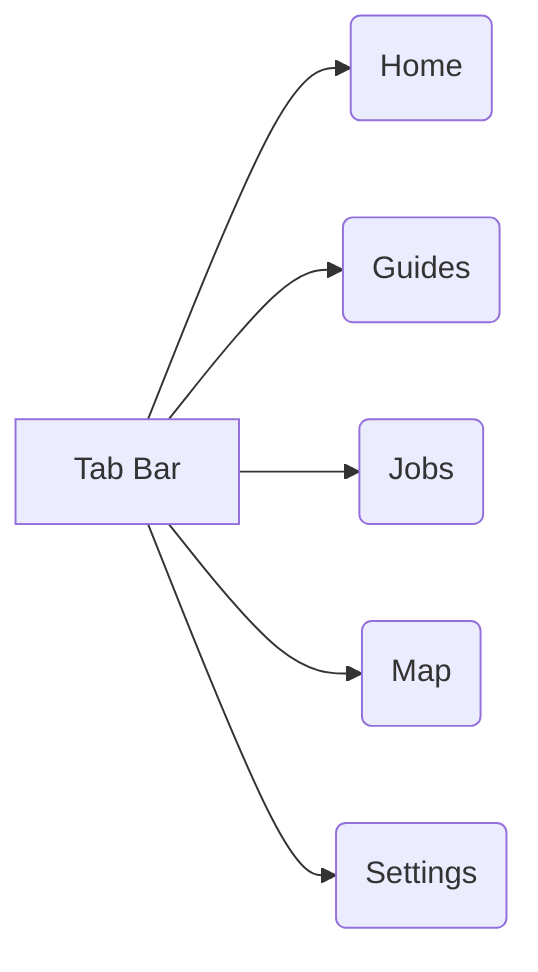

## 📱 User Journey — Sweezy (Mermaid)

Last updated: November 2025

### 1) High-level app flow

```mermaid
flowchart TD
    A[App Store Download] --> B[Splash / Launch]
    B --> C{Has account token?}
    C -- Yes --> H[Home]
    C -- No --> D[Auth Hub]
    D --> E[Login]
    D --> F[Register]
    D --> G[Forgot Password]
    F --> I[Onboarding (3-4 steps)]
    E --> J{New device?}
    J -- Yes --> I
    J -- No --> H
    I --> H

    subgraph Home Hub
    H --> H1[Integration Progress]
    H --> H2[Interactive Roadmap]
    H --> H3[Quick Actions]
    H --> H4[Personalized Guides]
    H --> H5[News Carousel]
    H --> H6[Gamification Bento]
    H --> H7{Pro Card (Free only)}
    H7 -- Tap --> P
    end

    H --> G1[Guides]
    H --> J1[Jobs]
    H --> C1[Checklists]
    H --> M1[Map]
    H --> S1[Settings]

    G1 --> G2[Guide Detail]
    J1 --> J2[Job Detail]

    subgraph Paywall
    P[Paywall] --> P1{Choose Plan}
    P1 --> P2[Trial Start]
    P1 --> P3[Purchase]
    P --> P0[Close]
    P2 --> H
    P3 --> H
    P0 --> H
    end
```

### 2) Paywall triggers



### 3) Auth flow + password reset



### 4) Subscription states machine



### 5) Settings/profile surfaces

```mermaid
flowchart LR
    S[Settings] --> SP[Profile Card: Free/Trial/Premium chip]
    S --> SG[Gamification Level Card]
    S --> SS[Subscription Block (Free only)]
    S --> SGn[General Settings: Language, Canton, Goal, Appearance, Notifications]
    S --> SA[Account: Change Password/Email, Manage/Restore, Sign Out, Delete]
    S --> SI[About: Terms, Privacy, Contact, Rate App]
```

### 6) Notifications journey



### 7) Gamification XP table (high level)



### 8) Tabs



### 9) Screens inventory (summary)

```mermaid
flowchart TB
    subgraph Core
    Splash --> Auth --> Onboarding --> Home
    end
    subgraph Content
    Home --> Guides --> GuideDetail
    Home --> Jobs --> JobDetail
    Home --> Checklists
    Home --> Map
    end
    subgraph Monetization
    Home --> Paywall --> Trial/Purchase
    Settings --> Manage/Restore
    end
    subgraph Account
    Settings --> ProfileEdit
    Settings --> General
    Settings --> Account
    Settings --> About
    end
```

---

## Tracking (Amplitude) — minimal event contract

- onboarding_started / onboarding_completed
- daily_open (properties: level, totalXP)
- paywall_view (source: guide/job/ai/pdf/home)
- paywall_cta_click (plan_selected, is_yearly_default)
- purchase_start / purchase_success / restore_success
- guide_opened / guide_read_completed (guideId, category, canton)
- job_saved (jobId, currentSaves)
- subscription_status_changed (status: free/trial/premium, trialEndsAt)

---

## RemoteConfig keys (suggested)

- paywall.defaultPlan: "yearly" | "monthly"
- paywall.benefits: string[]
- gamification.xpRules: { eventKey: number } map
- gamification.badges: string[]

---

This document mirrors the in-app user journey diagrams stored at `sweezy/userjorney` and converts them to Mermaid for portability in docs and design reviews.


